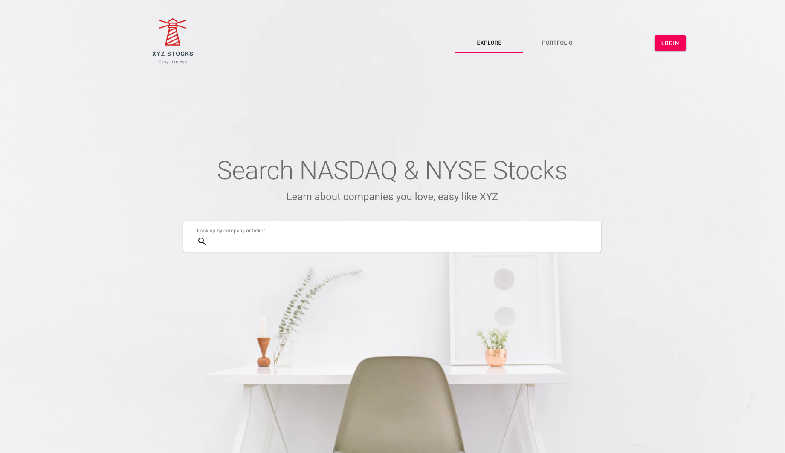
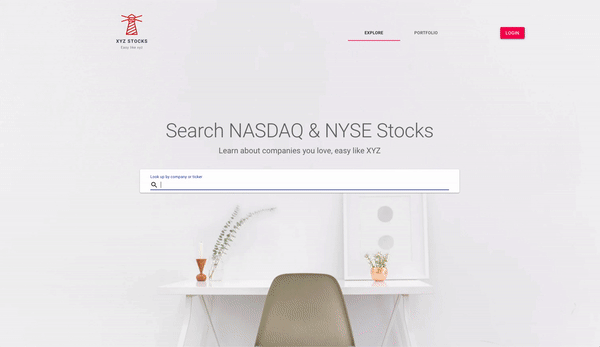
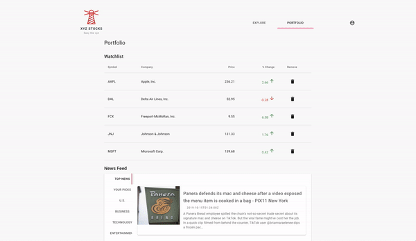
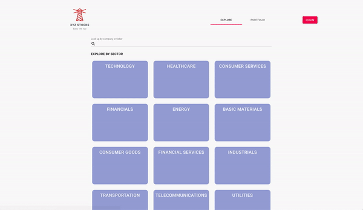

# XYZ Stocks 

**NASDAQ & NYSE Financial Information Search & Portfolio Website.**

A single-page application that displays aggregate stock data with a stock auto-complete search function and allows for portfolio watchlist

## Demo

Website: [https://react-xyz-stocks.web.app](https://react-xyz-stocks.web.app/)

Feel free to use the test login account supplied below:

Test Login Account: test@test.com

Test Login Password: test123

## Key Features

### Auto-Complete Search

Displays query suggestions based on search input to enhance user search experience

### Portfolio

Portfolio allows user to manage stock watchlist and provides a personalized news feed according to watchlist

### Sector Search

Integrated 3 third-party financial and news RESTful API’s to aggregate stock data ([IEX Cloud](https://iexcloud.io/docs/api/),[News API](https://newsapi.org/docs) & [Financial Modeling Prep API](https://financialmodelingprep.com/developer/docs/))

## Built with

- [React.js](https://reactjs.org/) (v16)- The Web framework used
- [React Router](https://reacttraining.com/react-router/web/guides/quick-start)
- Firebase ([Cloud Firestore,](https://firebase.google.com/docs/firestore) [Authentication](https://firebase.google.com/docs/auth), [Hosting](https://firebase.google.com/docs/hosting))
- [Google Charts](https://developers.google.com/chart) - Interactive charts for browsers and mobile devices
- [Material UI](https://material-ui.com/) - React components for implementing Google's Material design

## Code Style

- Airbnb (Linted with ESLint)

## API Reference

- [IEX Cloud](https://iexcloud.io/docs/api/) - Financial data platform for developers
- [News API](https://newsapi.org/docs) - A JSON API for live news and blog articles
- [Financial Modeling Prep API](https://financialmodelingprep.com/developer/docs/) - A free, web-based API providing stock related information

## Inspiration

- [Google Finance](https://www.google.com/finance) - Monitor the market with free stock quotes and up-to-date financial news.
- [Wallmine](https://wallmine.com/) - Finance & Investing: Stocks, Crypto, Forex, ETFs

## Author

Ting Chang

- GitHub: [@this-ting](https://github.com/this-ting)

## License

This project is licensed under the MIT License.
